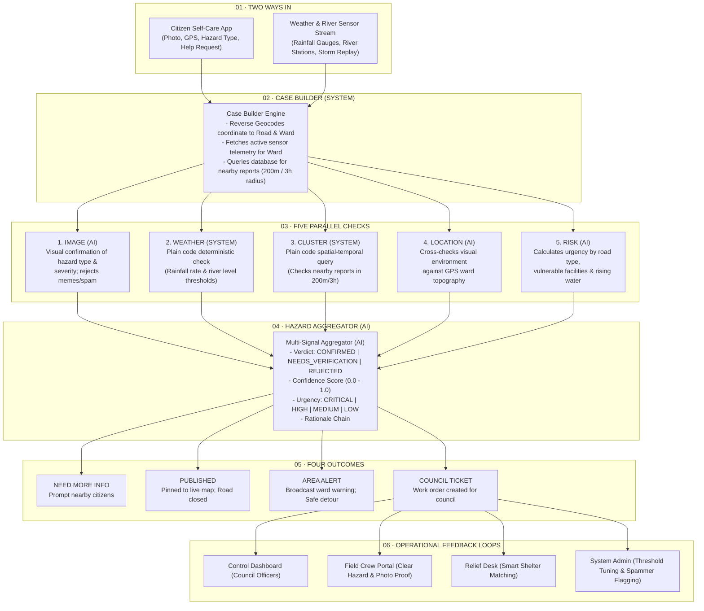

# 🌊 ResQCity · AI-Powered Urban Disaster & Road Hazard Response System

> **CodeArena '26 Ideathon — Topic 04: Coordinating City Response to Floods and Road Hazards**

ResQCity is an end-to-end intelligent disaster orchestration system designed to harmonise physical sensor telemetry with citizen hazard submissions. Built strictly according to the **6-stage reference architecture**, ResQCity processes raw multi-modal inputs through a **5-check hybrid verification pipeline (2 Deterministic SYSTEM + 3 AI Checks)**, produces an explainable **Hazard Aggregator verdict**, triggers **4 automated system outcomes**, and coordinates a **4-role operational response chain** with continuous feedback learning loops.

---

## 📑 Table of Contents
- [Architecture Overview](#-architecture-overview)
- [The 5-Check Hybrid AI Engine](#-the-5-check-hybrid-ai-engine)
- [Operational Stakeholder Portals](#-operational-stakeholder-portals)
- [Key Features](#-key-features)
- [Tech Stack](#-tech-stack)
- [Getting Started](#-getting-started)
- [Testing & Evaluation](#-testing--evaluation)
- [Project Layout](#-project-layout)

---

## 🏗️ Architecture Overview

The system strictly follows the **6-Stage Reference Architecture** mandated by the CodeArena '26 specification:



---

## ⚡ The 5-Check Hybrid AI Engine

| Check | Type | Engine | Description | Output Payload |
|---|---|---|---|---|
| **1. IMAGE** | **AI** | Vision Model | Evaluates uploaded photos for hazard signatures and visual severity rating; rejects spam/memes. | `{ pass, detectedHazard, visualSeverity, confidence, rationale }` |
| **2. WEATHER** | **SYSTEM** | Rule Engine | Plain deterministic rule check matching rainfall rate (`≥30mm/h`) or river gauge (`≥75% capacity`). | `{ pass, currentRainfall, riverLevelPct, thresholdExceeded, ruleMatched }` |
| **3. CLUSTER** | **SYSTEM** | Spatial Query | Deterministic query checking if $\ge 2$ reports exist within a 200m radius in the last 3 hours. | `{ pass, clusterCount, radiusMeters, timeWindowHours, matches }` |
| **4. LOCATION** | **AI** | Multimodal AI | Cross-checks environmental visual markers (sky, road surface) against ward topography. | `{ pass, topographyMatch, environmentalSignatures, rationale }` |
| **5. RISK** | **AI** | Criticality AI | Evaluates infrastructure importance (Arterial vs Local road) and proximity to hospitals/vulnerable zones. | `{ pass, criticality, roadType, nearbyVulnerableFacilities, urgencyScore }` |

---

## 👥 Operational Stakeholder Portals

ResQCity features tailored interactive interfaces for 4 distinct operational roles:

1. **📱 Citizen Portal**: Submit hazard reports with photos and GPS; flag emergency evacuation needs (household count, vulnerable members, supplies); confirm/verify nearby reports.
2. **🏛️ Council Control Dashboard**: Inspect the full 5-check breakdown and AI rationale per case; dispatch specialized emergency squads (`Rapid Flood Pump`, `Road Clearance Squad`).
3. **🚛 Field Crew Portal**: Access safe navigation routing avoiding flooded cordons; upload verified completion photos to resolve work orders and reopen public roads.
4. **🏠 Relief & Shelter Desk**: Smart shelter matching for displaced households based on live bed capacity, food, water, and medical supply inventory.
5. **⚙️ System Admin**: Tune AI verdict confidence thresholds, manage flagged false reporters, and monitor continuous learning feedback logs.

---

## ✨ Key Features

- **⛈️ Storm Stream Replay Engine**: Simulates multi-phase heavy rainfall events (e.g. 150mm over 6 hours), triggering autonomous sensor alerts before citizen complaints arrive.
- **🗺️ Interactive GIS Hazard Map**: Real-time Leaflet GIS mapping rendering flood cordons, active sensor telemetry, squad positions, and safe detour paths.
- **🔄 Live WebSocket Event Streaming**: Instant push notification sync across all client dashboards for dispatches, state updates, and alerts.
- **🔐 Role-Based Access & Authentication**: JWT authentication with instant demo role switching and RBAC authorization locks.

---

## 💻 Tech Stack

- **Frontend**: React 18, Vite, TypeScript, Tailwind CSS, Leaflet GIS, Lucide Icons.
- **Backend**: Node.js, Express, TypeScript (`tsx`), WebSockets (`ws`), MySQL (`mysql2` with in-memory fallback), JWT, `bcryptjs`.
- **AI & Integrations**: NVIDIA AI API client integration, hybrid vision & reasoning diagnostics engine.

---

## 🚀 Getting Started

### Prerequisites
- **Node.js**: `v18.x` or higher
- **npm**: `v9.x` or higher

### Installation & Local Setup

1. **Clone the repository**:
   ```bash
   git clone https://github.com/YourOrg/Code-Arena-Disaster-Com-.git
   cd Code-Arena-Disaster-Com-
   ```

2. **Install dependencies**:
   ```bash
   npm install
   npm --prefix client install
   ```

3. **Configure Environment Variables**:
   Copy `.env.example` to `.env` if custom configurations are needed (defaults work out of the box with in-memory data store):
   ```bash
   cp .env.example .env
   ```

4. **Run Development Mode** (starts concurrent backend & frontend servers):
   ```bash
   npm run dev
   ```
   - **Frontend**: `http://localhost:5173`
   - **Backend API**: `http://localhost:3001`
   - **WebSocket Stream**: `ws://localhost:3001/ws`

### Available Scripts

- `npm run dev`: Runs server and client concurrently.
- `npm run dev:server`: Starts backend server only with `tsx`.
- `npm run dev:client`: Starts Vite frontend client only.
- `npm test`: Runs automated test suite (`tsx server/src/tests/test_suite.ts`).

---

## 🧪 Testing & Evaluation

For a comprehensive step-by-step walkthrough verifying all 8 test cases, refer to the [TESTING_GUIDE.md](file:///e:/Competition/CodeAreba/Code-Arena-Disaster-Com-/TESTING_GUIDE.md) document.

Key manual test scenarios include:
- **TC-01**: End-to-end Citizen Hazard Submission & AI Verdict.
- **TC-02**: Vision AI Spam & Meme Photo Rejection.
- **TC-03**: Autonomous Pre-emptive River Crest Telemetry Trigger.
- **TC-05**: Council Officer 5-Check Breakdown Inspection & Squad Dispatch.
- **TC-06**: Field Crew Detour Navigation & Photographic Resolution.
- **TC-07**: Smart Relief Shelter Allocation for Evacuated Families.

---

## 📁 Project Layout

```
Code-Arena-Disaster-Com-/
├── package.json                   # Root package & script definitions
├── SOLUTION.md                    # Detailed architectural & engineering spec
├── TESTING_GUIDE.md               # 8-step manual testing protocol
├── ResQCity_Postman_Collection.json # Importable Postman REST API collection
├── server/                        # Express + TypeScript API Server
│   └── src/
│       ├── index.ts               # Server & WebSocket initialization
│       ├── routes/                # API routes (Auth, Cases, Sensors, Shelters)
│       ├── services/              # 5-check engines, aggregator, routing & AI services
│       ├── db/                    # Data store & persistence service
│       └── tests/                 # Automated test suite
└── client/                        # React + Vite Frontend Client
    └── src/
        ├── App.tsx                # Main layout, router & auth lock
        ├── components/            # Portals, Leaflet Map, Modals, Simulator Bar
        └── services/api.ts        # Client API SDK & WebSocket subscriber
```
