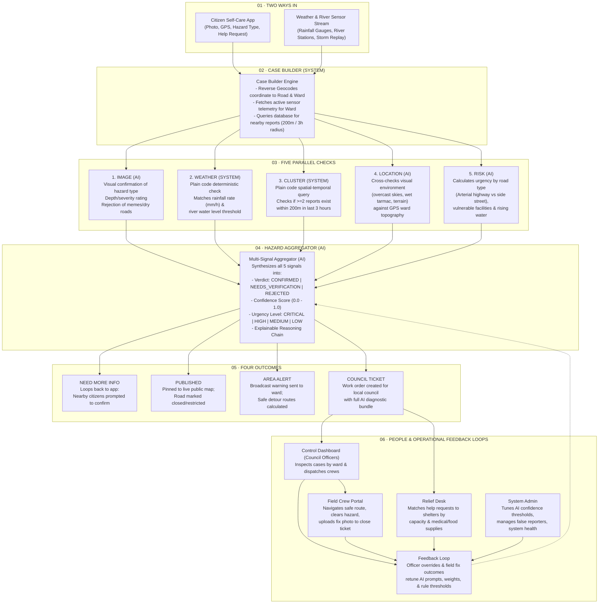

# RESQCITY · Urban Flood & Road Hazard Coordination Platform
## Topic 04: Coordinating City Response to Floods and Road Hazards
### CodeArena'26 Ideathon · Full Solution Architecture & Engineering Specification

---

## 1. Executive Summary & Problem Formulation

### 1.1 The Challenge
During severe monsoon and cyclonic rainfall events, urban centers experience rapid flash flooding, fallen trees, blocked drains, and road washouts. Municipal councils face three critical bottlenecks:
1. **Unverified & Noisy Influx**: Citizens report hazards and plead for help across fragmented channels (social media, calls, chat apps) with unverified photos, duplicate entries, and ambiguous locations.
2. **Delayed Response vs. Accelerating Hazards**: Sensor alerts (river gauge spikes, rainfall telemetry) remain siloed from citizen reports, leading to delayed road closures and preventable stranded vehicles.
3. **Sub-optimal Relief & Triage**: Council officers lack real-time decision intelligence to prioritize which hazard to clear first, how to route emergency crews safely around flooded roads, and how to match displaced families to shelters with remaining capacity.

### 1.2 The Solution: ResQCity
**ResQCity** is an end-to-end intelligent disaster orchestration system built strictly on the **6-stage pipeline architecture** mandated by the CodeArena'26 specification. It harmonizes physical sensor streams with citizen submissions, runs a **5-check hybrid verification pipeline (2 Deterministic SYSTEM + 3 AI Checks)**, produces an explainable **Hazard Aggregator verdict**, triggers **4 automated outcomes**, and closes the loop with a **4-role human response chain**.

---

## 2. Strict Architectural Alignment with the 6-Stage Reference Flow



---

## 3. Detailed Stage-by-Stage Functional Specification

### Stage 01: Two Ways In (Dual Ingestion Inlets)
1. **Citizen App (Inbound Human Stream)**:
   - **Hazard Submission**: Citizens capture or upload a photo, auto-detect or pin GPS coordinates, select hazard category (`Flooding`, `Fallen Tree`, `Landslide`, `Blocked Drain`, `Submerged Vehicle`), and provide an optional description.
   - **Emergency Rescue & Help Request**: Citizens trapped or needing evacuation specify household member count, vulnerable members (elderly, infants, patients), and urgent supply needs (drinking water, food, dry shelter, medical assistance).
2. **Weather & River Sensor Stream (Inbound Telemetry Stream)**:
   - Automated streaming feed from rain gauge telemetry (`mm/hr`) and ultrasonic river level sensors (`% capacity` and `meters above sea level`).
   - Includes a **Time-Series Storm Replay Engine** that replays historical extreme weather events (e.g. 150mm flash storm over 6 hours), automatically generating proactive sensor cases before citizens even start reporting.

---

### Stage 02: Case Builder (SYSTEM Engine)
The Case Builder is a deterministic backend service that enriches every incoming raw report before checks are executed:
- **Spatial Resolution**: Maps raw GPS coordinates `(lat, lng)` to the corresponding city **Ward** (e.g., Ward 01 - Colombo Fort, Ward 04 - Kelani River Basin, Ward 07 - Cinnamon Gardens) and the exact **Road Segment** (e.g., `Baseline Road (Arterial A1)`).
- **Environmental Context Binding**: Pulls the latest live sensor readings from the nearest rain gauge and upstream river station within the ward.
- **Historical & Cluster Context**: Queries existing open and resolved cases within a **200-meter radius** and **3-hour time window**.
- **Reporter Reputation Lookup**: Retrieves the submitter's trust history score (1.0 = highly trusted, 0.0 = flagged spammer).

---

### Stage 03: The Five Parallel Checks (Hybrid AI + Deterministic Rule Engine)

| Check Name | Type | Engine | Exact Logic & Evaluation Rules | Output Payload |
|---|---|---|---|---|
| **1. IMAGE** | **AI** | Vision AI / Model | Inspects photo pixels for hazard signatures (water depth vs car tires, fallen tree branches across asphalt, mud debris). Rejects irrelevant uploads (food photos, dry rooms, internet memes). | `{ pass: boolean, detectedHazard: string, visualSeverity: "MINOR"\|"MODERATE"\|"SEVERE", confidence: number, rationale: string }` |
| **2. WEATHER** | **SYSTEM** | Plain Code Rules | Deterministic rule execution: `(wardRainfall >= 30mm/hr) OR (riverLevel >= 75%) OR (accumulatedRain3h >= 60mm)`. If true, weather corroborates flood risk. | `{ pass: boolean, currentRainfall: number, riverLevelPct: number, thresholdExceeded: boolean, ruleMatched: string }` |
| **3. CLUSTER** | **SYSTEM** | Plain Code Geospatial | Spatial-temporal query using Haversine distance: Checks if `count(reports where distance <= 200m AND time_delta <= 180min) >= 1`. Multiple independent reports amplify verification. | `{ pass: boolean, clusterCount: number, nearbyReportIds: string[], densityScore: number }` |
| **4. LOCATION** | **AI** | Multimodal AI | Analyzes scene context (lighting, overcast sky, street topography, utility poles) against claimed ward characteristics and GPS elevation profile to detect spoofed coordinates. | `{ pass: boolean, sceneConsistencyScore: number, environmentalMatch: boolean, reasoning: string }` |
| **5. RISK** | **AI** | Predictive Impact AI | Evaluates operational priority based on: Road hierarchy (`Arterial Highway` = 1.0, `Secondary` = 0.6, `Residential` = 0.3), proximity to critical facilities (hospitals, schools, transformer yards), and rate of water rise. | `{ pass: boolean, riskScore: number, urgency: "CRITICAL"\|"HIGH"\|"MEDIUM"\|"LOW", impactFactors: string[] }` |

---

### Stage 04: Hazard Aggregator (AI Decision Engine)
The Aggregator synthesizes the 5 discrete check signals using an AI synthesis prompt with structured schema output:
- **Decision Matrix**:
  - **CONFIRMED** ($Confidence \ge 0.75$ or $ImagePass \land WeatherPass \land ClusterPass$): High probability of active hazard. Auto-triggers road closure, alert broadcast, and council ticket.
  - **NEEDS_VERIFICATION** ($0.45 \le Confidence < 0.75$): Plausible hazard but lacking corroborated weather data or cluster confirmation. Triggers community verification loop.
  - **REJECTED** ($Confidence < 0.45$ or Invalid Image / Spam score $> 0.80$): Discarded with recorded rationale; user reputation penalized if spam.
- **Explainability Output**: Generates an audit trail showing the contribution of each check to the final decision.

---

### Stage 05: The Four Outcomes (Automated Action Engine)

1. **`NEED MORE INFO` (Community Crowdsource Loop)**:
   - If a report is unverified, an automated ping is dispatched to active citizens within 300 meters: *"A flood was reported on your street. Can you confirm if water is accumulating?"*
2. **`PUBLISHED` (Live Public Hazard Map & Road Closure)**:
   - Confirmed hazards are instantly rendered on the public GIS map with severity heatmaps and marked road blockages.
3. **`AREA ALERT` (Localized Broadcast & Smart Detour Navigation)**:
   - Ward-level SMS and push alerts broadcast to residents.
   - **Smart Detour Routing Engine**: Calculates safe detour routes around flooded road segments using dynamic graph routing (A* Dijkstra).
4. **`COUNCIL TICKET` (Automated Dispatch Ticket)**:
   - Generates a rich work order for the Municipal Council containing the full AI diagnosis bundle, required equipment (chainsaw for fallen tree, high-volume water pump for flooded underpass), and crew assignment.

---

### Stage 06: People and Operational Feedback Loops (The 4-Role Chain)

```
[Citizen Reports / Sensors Alarm]
          │
          ▼
   [AI Aggregator]
          │
          ▼
┌─────────────────────────────────────────────────────────────┐
│ 1. COUNCIL OFFICER (Control Dashboard)                      │
│    - Inspects GIS map by Ward & Urgency                     │
│    - Reviews 5-check breakdown & approves dispatch          │
└──────────────────────────────┬──────────────────────────────┘
                               │ Dispatches crew
                               ▼
┌─────────────────────────────────────────────────────────────┐
│ 2. FIELD CREW (Mobile Field View)                           │
│    - Receives turn-by-turn safe detour route                │
│    - Arrives on site, clears blockage / pumps water         │
│    - Uploads 'Resolution Completion Photo'                  │
│    - Closing job automatically clears hazard from public map│
└──────────────────────────────┬──────────────────────────────┘
                               │ Closes ticket
                               ▼
┌─────────────────────────────────────────────────────────────┐
│ 3. RELIEF COORDINATOR (Relief Desk)                         │
│    - Triages stranded citizens / evacuation requests        │
│    - Matches families to nearest shelter with free beds     │
│    - Dispatches food rations, clean water, medical aid      │
└──────────────────────────────┬──────────────────────────────┘
                               │
                               ▼
┌─────────────────────────────────────────────────────────────┐
│ 4. SYSTEM ADMIN & AI LEARNING LOOP                          │
│    - Adjusts global AI confidence thresholds (e.g. 0.70)    │
│    - Flags & bans persistent false reporters                │
│    - Human overrides feedback to fine-tune AI check weights │
└─────────────────────────────────────────────────────────────┘
```

---

## 4. Stretch Goals & Advanced Capabilities

### 4.1 Safe Detour & Dynamic Evacuation Pathfinding
- **Graph-Based Road Network**: City roads are represented as a weighted directional graph.
- **Dynamic Weight Penalties**: When a road segment is marked `CLOSED` or `FLOODED`, its traversal cost is set to infinity ($\infty$).
- **Detour Generator**: Computes the fastest safe alternate route for citizens and emergency vehicles, completely bypassing hazard zones.

### 4.2 Intelligent Shelter & Relief Resource Allocation
- **Capacity-Constrained Matching**: Matches evacuated citizens to relief shelters based on:
  - Distance / travel time via non-flooded roads.
  - Available bed capacity ($Occupants + NewHousehold \le MaxCapacity$).
  - Specific needs (e.g. wheelchair accessibility, specialized medical supplies, infant formula).
- **Real-Time Logistics Tracker**: Live dashboard showing inventory levels of food packets, clean water litres, blankets, and medical kits across all active shelters.

### 4.3 Pre-emptive Sensor Outbreak Detection
- Analyzes upstream river basin water levels and rainfall gradient across wards.
- Raises pre-emptive area warnings 45 minutes before low-lying downstream roads flood, enabling proactive evacuations.

---

## 5. Complete Technical Architecture & Data Model

### 5.1 Data Models (TypeScript / Database Schema)

```typescript
// Core Data Contracts for ResQCity Platform

export type HazardType = 'FLOOD' | 'FALLEN_TREE' | 'LANDSLIDE' | 'BLOCKED_DRAIN' | 'DOWNED_POWERLINE';
export type SeverityLevel = 'LOW' | 'MEDIUM' | 'HIGH' | 'CRITICAL';
export type CaseStatus = 'PENDING' | 'VERIFIED' | 'IN_PROGRESS' | 'RESOLVED' | 'REJECTED';
export type Verdict = 'CONFIRMED' | 'NEEDS_VERIFICATION' | 'REJECTED';

export interface LocationCoordinates {
  lat: number;
  lng: number;
  roadName: string;
  wardId: string;
  wardName: string;
}

export interface CitizenReport {
  id: string;
  createdAt: string;
  userId: string;
  userName: string;
  userTrustScore: number;
  hazardType: HazardType;
  severity: SeverityLevel;
  location: LocationCoordinates;
  imageUrl: string;
  description: string;
  needsRescue: boolean;
  householdCount?: number;
  specialNeeds?: string[];
}

export interface SensorTelemetry {
  stationId: string;
  stationName: string;
  wardId: string;
  rainfallRateMmH: number; // mm per hour
  rainfallAccumulated3h: number; // mm in last 3 hours
  riverLevelMeters: number;
  riverCapacityPct: number; // 0 - 100%
  status: 'NORMAL' | 'WARNING' | 'DANGER';
  updatedAt: string;
}

export interface CheckOutput<T = any> {
  checkName: 'IMAGE_AI' | 'WEATHER_SYSTEM' | 'CLUSTER_SYSTEM' | 'LOCATION_AI' | 'RISK_AI';
  engine: 'AI' | 'SYSTEM';
  passed: boolean;
  score: number; // 0.0 to 1.0
  summary: string;
  details: T;
}

export interface AggregatorVerdict {
  caseId: string;
  verdict: Verdict;
  confidenceScore: number; // 0.0 to 1.0
  urgency: SeverityLevel;
  primaryHazard: HazardType;
  checks: {
    image: CheckOutput;
    weather: CheckOutput;
    cluster: CheckOutput;
    location: CheckOutput;
    risk: CheckOutput;
  };
  reasoningChain: string[];
  recommendedActions: string[];
  triggeredOutcomes: ('NEED_MORE_INFO' | 'PUBLISHED' | 'AREA_ALERT' | 'COUNCIL_TICKET')[];
}

export interface Shelter {
  id: string;
  name: string;
  wardId: string;
  location: LocationCoordinates;
  totalCapacity: number;
  currentOccupancy: number;
  isOpen: boolean;
  supplies: {
    foodPacks: number;
    waterLitres: number;
    medicalKits: number;
    blankets: number;
  };
  amenities: string[];
  contactPhone: string;
}

export interface CouncilTicket {
  id: string;
  caseId: string;
  createdAt: string;
  wardId: string;
  hazardType: HazardType;
  urgency: SeverityLevel;
  status: 'OPEN' | 'DISPATCHED' | 'ON_SITE' | 'RESOLVED';
  assignedCrewId?: string;
  assignedCrewName?: string;
  resolutionPhotoUrl?: string;
  resolvedAt?: string;
  resolutionNotes?: string;
}
```

---

## 6. End-to-End Verification & Demonstration Protocol

| Step | Persona | Action | Expected System Behavior | Reference Flow Verification |
|---|---|---|---|---|
| **1** | **Citizen** | Submits flood report on Baseline Road with photo and GPS | Case builder links Ward 01; 5 checks execute in parallel; AI Aggregator scores 94% confidence. | **Stage 01 -> 02 -> 03 -> 04** |
| **2** | **System Engine** | Outbreak triggers 4 outcomes automatically | Pinned to Public Map; Road marked closed; Broadcast alert sent; Council dispatch ticket raised. | **Stage 05** |
| **3** | **Council Officer** | Opens Control Dashboard and inspects AI diagnostic bundle | Views 5-check breakdown with reasons; dispatches "Flood Pump Unit 2". | **Stage 06 (Officer)** |
| **4** | **Field Crew** | Views work order, follows detour route, uploads fix photo | Work order marked "RESOLVED"; public map hazard cleared in real-time. | **Stage 06 (Crew & Public Map)** |
| **5** | **Relief Desk** | Receives family evacuation request (4 people) | Auto-matches to "St. Mary's Shelter" (28 beds free); routes rescue vehicle. | **Stage 06 (Relief)** |
| **6** | **Weather Replay** | Activates "Extreme Monsoon Flash Flood" sensor simulation | Rain gauges cross 55mm/hr; proactive area alerts generated prior to calls. | **Stage 01 (Sensor Feed)** |
| **7** | **System Admin** | Modifies confidence threshold & tests false spam image | Meme image scored 12% by Image AI -> Auto-rejected; spam reporter logged. | **Stage 04 & 06 (Admin/Feedback)** |

---

## 7. Conclusion

This solution strictly adheres to the CodeArena'26 Ideathon Topic 04 brief, realizing the entire 6-stage architecture without omissions. It combines real deterministic telemetry with explainable AI reasoning, delivering an actionable, life-saving urban disaster response system.
